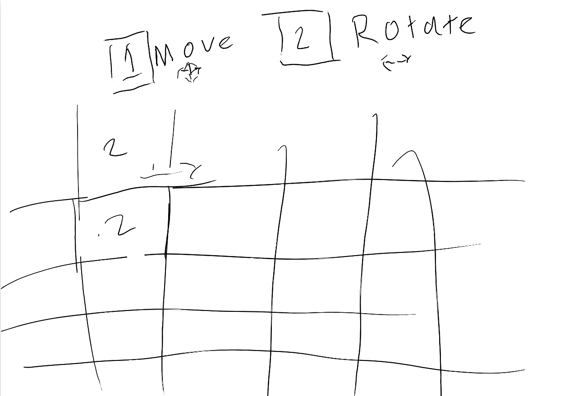
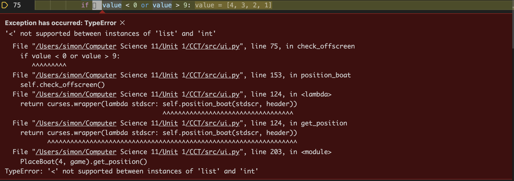
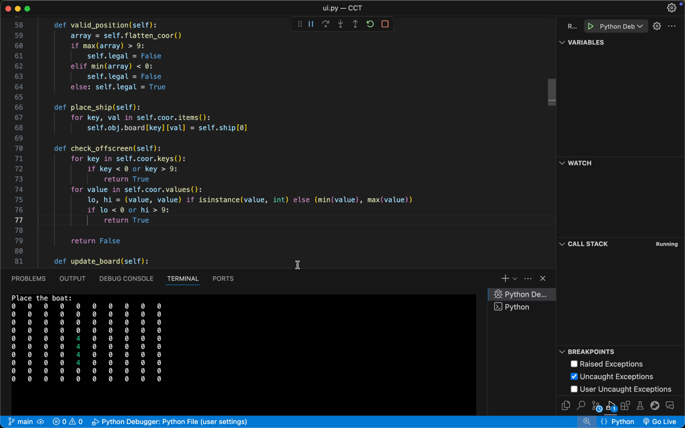
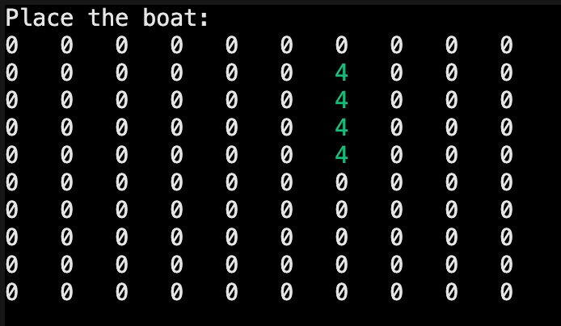
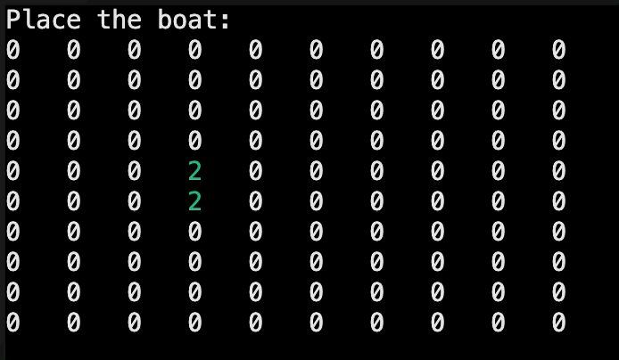

## Day 1 - Wednesday December 10th

I decided that battleship was a good challenge for me if I did it with curses. On this day I made my first attempt at the menu ui. I was thinking I could have two modes for the user: rotate and move.

This proved incredibly difficult to implement and I ended up running out of time so I decided to continue the next day and sleep on it.

## Day 2 - Thursday December 12th

I came up with a new solution. I could have the user press R to rotate and the arrow keys to move around. This solution seemed to be much easier. Then the question became how to rotate the boat. The idea was to use a quandrant system similar to my SOS game where depending on the quandrant the reference coordinate would be different. This again wasn't going to work because the rotation would change the quandrant and the code got really messy.

## Day 3 - Friday December 13th

I found a way to do this and have it work. This time we'll use angles and a single reference coor.

```python
if self.angle == 90:
    self.coor = {y+i: x for i in range(ship)}
elif self.angle == 180:
    self.coor = {y: [x-i for i in range(ship)]}
elif self.angle == 270:
    self.coor = {y - i: x for i in range(ship)}
else:
    self.coor = {y: [x+i for i in range(ship)]}
```

The problem I ran into that day is that there were a lot of headaches with x and y along with a bunch of type errors because the data had wierd formats that I usually try to avoid.

I also ran into problems where the boat would be offscreen and that it would be off when I rotate the boat.

I also ran into some typeerrors.

# Day 4 - Thursday December 16

I finally found a way to make the arrow keys work well and look good. I added a red highlight when the boat wasn't allowed to be placed in that location. I use a reference coor for rotation and a dictionary to store the location of every single coor of the boat for movement.


I split up `flatten_coor` and `concatenate_coor`

```python
def concatenate_coor(self):
    return list(map(list, self.coor.items()))

def flatten_coor(self):
    flat_list = []
    for k, v in self.coor.items():
        flat_list.extend([k, v])
    return flat_list
```

Also on this day I started using the VS code python debugger. I've never felt so productive in my life. It gives me all the key variables in a side bar and I've been fixing errors so quickly



I then went on to fix a bunch of errors occuring since I was using dicts. Essentially I had to turn the keys and vals into lists or ints depending on how many dupes there are in the position. There were a bunch of errors but once fixed I could finally rotate the boat.



I also found a way to do this:

```python
self.working_board = deepcopy(self.board)
for Ys in self.coor.keys():
    Ys = [Ys] if type(Ys) == int else Ys
    for y in Ys:
        if type(Ys) == int:
            y = Ys
            for Xs in iter(self.coor.values()):
                if type(Xs) == list:
                    for x in Xs:
                        try:
                            self.working_board[y][x] = self.ship[0]
                        except: continue
                else:
                    x = Xs
                    try: self.working_board[y][x] = self.ship[0]
                    except: continue
        else:
            for y in Ys:
                for Xs in self.coor.values():
                    if Xs == type(list):
                        for x in Xs:
                            try: self.working_board[y][x] = self.ship[0]
                            except: continue
                    else:
                        try: self.working_board[y][x] = self.ship[0]
                        except: continue
```

In so many fewer lines

```python
self.working_board = deepcopy(self.board)
for Ys in self.coor.keys():
    Ys = [Ys] if type(Ys) == int else Ys
    for y in Ys:
        for Xs in self.coor.values():
            Xs = [Xs] if type(Xs) == int else Xs
            for x in list(Xs):
                self.working_board[y][x] = self.ship[0]
```

Finally after fixing all my bugs where I used .keys instead of .keys() it's working perfectly.


Now all I need to do is do that for all the ships.

```python
if __name__ == "__main__":
    game = Board(r"Simon's test")
    for i in range(2, 6):
        PlaceBoat(i, game).get_position()
```

And update valid position to account for the extra ships

```python
a2 = self.concatenate_coor()
for coor in a2:
    if coor in self.obj.taken_coor:
        self.legal = False
        return
```



# Day 5 - Friday December 17th

I ran into a few errors with the logic I assumed would work or that I'd figure out later like the attack class and the main class.


```python
object = list[list[int]] # Problematic line
object: list[list[int]] = [] # Fixed line
```

I also started on the attack feature. I'm going for the same grid I used in my SOS game. Smooth sailing so far. Each bot needed to be assigned an ID because I want to implement a custom rule where a defeated boat is placed on the other side.

```python
def onhit(self, coor):
    boatsbyID = self.obj.boats

    for ID in boatsbyID:
        if coor in boatsbyID[ID]:
            self.obj.boats[ID].remove(coor)

        if len(boatsbyID[ID]) < 1:
            self.player.to_place.append(self.obj.typebyID[ID])
            del self.obj.boatsbyID[ID]
            del self.obj.typebyID[ID]
```

# Day 6 - Dec 24th

I got some time in. Finished the attack functions for the user. I'm now finalizing the AI logic. The main thing I've been struggling with is the custom rule which lead me to creating a lot of different class variables. Thank god for classes.
Just finished the outline for the AI.

```python
def auto_move(self):
    obj = self.p2
    for pending in obj.to_place:
        if obj.is_possible(pending): # TODO
            obj.auto_place_boat(pending) # TODO

    self.p2_atck.auto_pick_target() # TODO
```

I've been finding it tough to manage all the names of the classes so I've been forced to start commenting. The issue is that there is one data/main class for each player in which the attack and placement functions revolve around and each of them assumes different variables do different things. It took me some time to make both work together but nwo it works. The names are a little akward but I feel like this isn't something worth my time fixing because of how much time it would take.

```python
self.to_place: list[int] = []
self.hit_coors: list[list[int]] = []
self.taken_coor: list[list[int]] = []
self.blocked_coors: list[list[int]] = []
self.board = [[0 for i in range(10)] for i in range(10)]
self.hit_coors_byID: dict[int, list[list[int]]]
self.typebyID: dict[int, int] = {}  # Ship type by ID
self.unhit_coors: dict[int, list[list[int]]] = {} # By ID
```

# Day 7 - Thru Jan 1 3pm

Over the break I had loads of fun. Celebrated the new year a little uniquely by completing a 15km run and going to bed at 8pm but nonetheless I enjoyed my break. I used the time to implement some neck training into my split since I know when I grow up (hopefully) doing machine learning, I want to ensure my neck doesn't give out. I've been experiementing over the break with how I can make coding as enjoyable as possible in my daily life. Being able to do my exercise and workouts in the mornings seems to give me a big enjoyment boost in the afternoon for me to settle down and get some coding done.

Anyways as for coding I'm working on some of the finishing touches. Most of the heavy lifting I did before the end of the break so now I realistically have an hour here and there on some days. Today I worked on the auto_move function for the AI and checking if captured boats can be placed or not. Nothing big. No problems yet but I've delayed testing these functions till the end. I'm hoping this won't come back to bite me.

I also found that having multiple files for this project was mainly pretty unnessary. I've also been putting off checking the rubric requirements word for word and am more focused on just finishing. I have a general idea of them and I'm planning on giving myself enough time to review and modify accordingly in time.

## 5pm

I ran into some problems with wanting to instead of have ships be destroyed, have them be captured. To solve this I create a variable that increments every time an ID is generated. I put this in the main `Game` class. I currently have this in the `src/ui.py` file but I'm thinking about honestly reducing the file structure a bit since so far I haven't needed such a huge file structure for this project.

```python
class Game:
    def __init__(self):
        self.p1 = Board('Player')
        self.p2 = Board('Computer')
        self.ship_id_counter = 0
```

All that's left now is some testing, polishing of the UI, clear instructions, and a few finishing touches on when the game is over.

## Sun Jan 4th

To be completely honest I thought school started on the 12th. Since I planned to give myself a week of buffer I'm only a slight bit rushed today. I worked on the UI and on a super hard bug that took me an hour to solve. When I pulled out the Python debugger which has been working like magic for me, I finally figured out that the array contained up to 5 duplicate coordinates which meant that when I removed one it still needed to be guessed 5 more times to be completely removed. Once I figured that out the fix was pretty quick. Then I moved to improving the UI and creating a game ending function. Those took ridiculously less time than the issue. I'm loving how it looks now.


I've been runing intoa lot of duplicate errors all over my code but honestly it's to late to implement new data structures. Instead I'm modifying functions that aren't working 100% of the time to work with the duplicate coordinates.

Alright so I've finished the full code, I've decided to leave sukin ships in the place ship ui and just color them red. Game ends if all possible guessses have been made or a player has shot down all the enemies ships

I kinda went a little wield on the file metadata and I made a `rubric.py` file just to hit all the requirements.

The cielling in my house fell on us so it's been hard to be productive moving all around Toronto until we can go back home. I've been rushed to finish the IPO model and the readme. I'm hoping I can get a day extension on this just to spend a little more time elborating in the readme and comments. I'm prepared to present either way.
